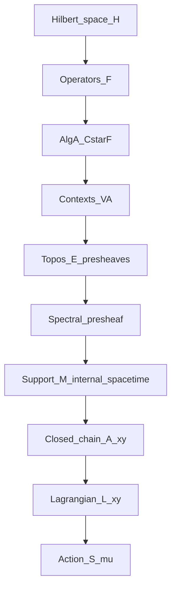

# Reconstruction des Causal Fermion Systems (CFS) au-dessus d’un topos quantique

## Objectif
Reformuler un Causal Fermion System (CFS) $$\((\mathcal H,\ \mathcal F,\ \rho)\)$$ — avec $$\(\mathcal H\)$$ hilbertien, $$\(\mathcal F\subset \mathcal L(\mathcal H)\)$$ ensemble d’opérateurs auto-adjoints de rang fini (contrôlé par la spin-dimension), et $$\(\rho\)$$ mesure universelle — comme **données internes** d’un **topos quantique**.  
Cela permet de relier :  
- la **variation causale** de Finster,  
- et la **logique intuitionniste** des topos (Isham, Döring, Heunen–Landsman–Spitters).

---

## 1. Choix du topos quantique

Deux approches principales :  

- **Bohrification (covariante)**  
  - Base : catégorie des sous-$$\(C^*\)$$-algèbres commutatives de $$\(A=C^*(\mathcal F)\)$$.  
  - Topos : $$\(\mathbf{Set}^{V(A)}\)$$.  
  - Avantage : l’algèbre interne $$\(\mathbf A\)$$ est **commutative** → spectre interne bien défini.

- **Presheaves contravariants (Isham–Döring)**  
  - Base : même poset $$\(V(A)\)$$, variance opposée.  
  - Topos : $$\(\mathbf{Set}^{V(A)^{op}}\)$$.  
  - Avantage : accès direct à la logique intuitionniste via le **spectral presheaf** $$\(\Sigma\)$$, la daseinisation et les valeurs de vérité (cribles).

👉 Pour reconstruire l’action causale (spectres d’opérateurs fermés), la bohrification est naturelle. Pour traiter la **logique de mesure**, le presheaf topos est idéal. On peut articuler les deux.

---

## 2. Données CFS en interne

1. **Algèbre interne** : $$\(A=C^*(\mathcal F)\)$$, bohrifiée en $$\(\mathbf A\)$$.  
2. **Spectre interne** : $$\(\mathbf\Sigma = \mathrm{Spec}(\mathbf A)\)$$ (locale interne).  
3. **Mesure universelle** : $$\(\rho\)$$ devient une **valuation interne** $$\(\boldsymbol\mu:\mathrm{Sub}(\mathbf\Sigma)\to [0,1]^{\leftrightarrow}\)$$.  
4. **Support** : $$\(\mathbf M = \mathrm{supp}(\boldsymbol\mu)\)$$ = espace-temps interne du CFS.  
5. **Absence de sections globales** : $$\(\mathbf\Sigma\)$$ n’a pas de point global ↔ théorème de Kochen–Specker ↔ contextualité intrinsèque.

---

## 3. Causalité et opérateurs fermés

- Dans CFS, la relation causale entre $$\(x,y\in \mathcal F\)$$ provient du spectre de l’opérateur fermé $$\(A_{xy}\)$$.  
- Dans le topos :  
  - **Points** : sections généralisées de $$\(\mathbf M\)$$.  
  - **Closed chain interne** : $$\(\mathbf A_{xy}\)$$ défini via produits/daseinisation dans $$\(\mathbf A\)$$.  
  - **Spectre interne** : calcul via $$\(\mathbb R^{\leftrightarrow}\)$$ (réels inférieurs/supérieurs).  
  - **Type causal** (time-/space-/light-like) = prédicats internes sur ces intervalles spectraux (formules en logique de Heyting).

---

## 4. Action causale dans le topos

- Lagrangien interne :  
  $$\[
  \boldsymbol{\mathcal L}(x,y) := f(\text{invariants spectraux de } \mathbf A_{xy})
  \in \mathbb R^{\leftrightarrow}_{\ge 0}.
  \]$$  
- Action :  
 $$\[
  \mathbf S[\boldsymbol\mu] = \iint_{\mathbf M\times \mathbf M}
     \boldsymbol{\mathcal L}(x,y)\ d\boldsymbol\mu(x)\ d\boldsymbol\mu(y).
  \]$$  
- Contraintes (volume, rang, énergie) formulées comme conditions internes dans la logique du topos.

---

## 5. Équations d’Euler–Lagrange internes

- Variations $$\(\delta \boldsymbol\mu\)$$ préservant les contraintes.  
- Condition EL interne :  
  $$\[
  \forall \delta\boldsymbol\mu,\quad \delta \mathbf S[\boldsymbol\mu]=0.
  \]$$  
- Interprétation externe : coïncide avec les EL des CFS de Finster, avec corrections dues à la contextualité (intervalles au lieu de valeurs propres nettes).

---

## 6. Exemple : cas du qubit

- $$\(\mathcal H = \mathbb C^2\)$$.  
- $$\(\mathcal F\)$$ = ensemble de projecteurs de rang fini.  
- $$\(V(A)\)$$ = sous-algèbres abéliennes engendrées par $$\(\sigma_x, \sigma_y, \sigma_z\)$$.  
- $$\(\mathbf\Sigma\)$$ sans point global (Kochen–Specker en dimension $$\(\ge 3\)$$, mais déjà non-trivial en 2D avec contextualité).  
- Les opérateurs fermés $$\(A_{xy}\)$$ se calculent comme matrices $$\(2\times 2\)$$; leurs valeurs propres deviennent **intervalles internes**.  
- L’action interne peut être explicitée et comparée à l’action CFS externe.

---

## 7. Schéma (Mermaid)

---

## 8. Perspectives

- **Limite commutative** : retrouver CFS classique comme cas particulier.  
- **Mesure quantique** : intégrer la règle de Born via valuations internes.  
- **Intrication** : comprendre les produits tensoriels internes et leurs obstructions.  
- **Lien avec complexité** : relier contraintes de ressources (raffinement de contextes) et principes de limitation computationnelle.  
- **Gravité quantique** : explorer comment la causalité interne rejoint la structure lorentzienne émergente.

---

## Bibliographie sélective

- F. Finster, *The Continuum Limit of Causal Fermion Systems* (Springer, 2016).  
- J. Butterfield & C.J. Isham, *A topos perspective on the Kochen–Specker theorem: I–VI*, Int. J. Theor. Phys. (2000–2002).  
- C.J. Isham & A. Döring, *A topos foundation for theories of physics: I–IV*, J. Math. Phys. (2007).  
- A. Döring & C.J. Isham, *What is a Thing? Topos Theory in the Foundations of Physics*, arXiv:0803.0417 (2008).  
- C. Heunen, N.P. Landsman, B. Spitters, *A topos for algebraic quantum theory*, Commun. Math. Phys. 291 (2009).  
- S. Abramsky & A. Brandenburger, *The sheaf-theoretic structure of non-locality and contextuality*, New J. Phys. 13 (2011).  

---

**Résumé**  
Les **CFS** fournissent une action variationnelle fondée sur la structure causale des opérateurs fermioniques.  
Les **topos quantiques** permettent de reformuler ces objets dans une logique intuitionniste contextuelle, donnant une alternative au multivers et ouvrant la voie à une intégration avec des principes de calcul et de gravité quantique.
